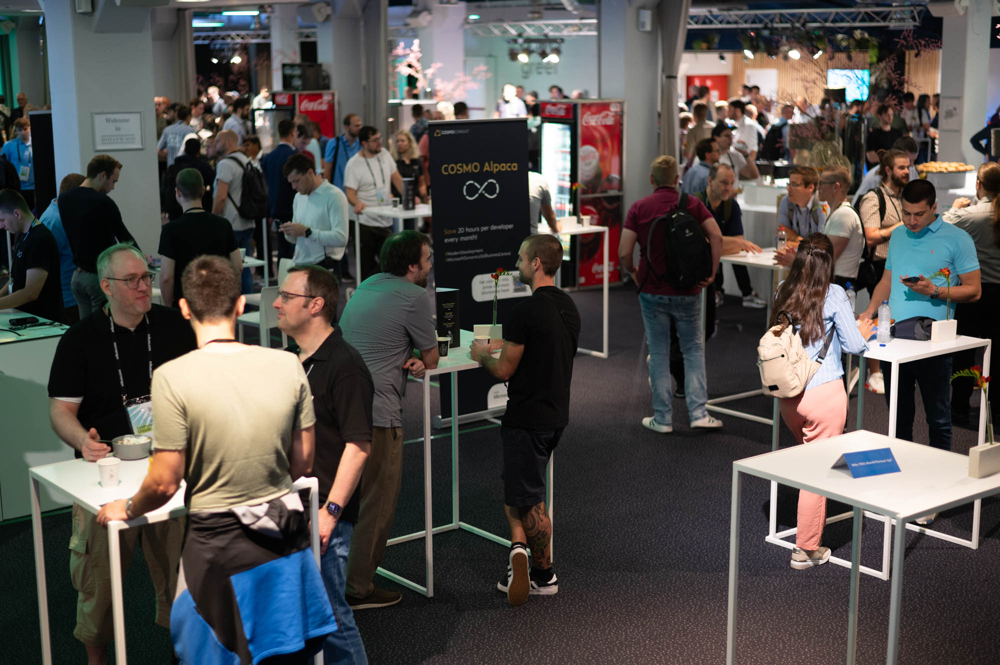
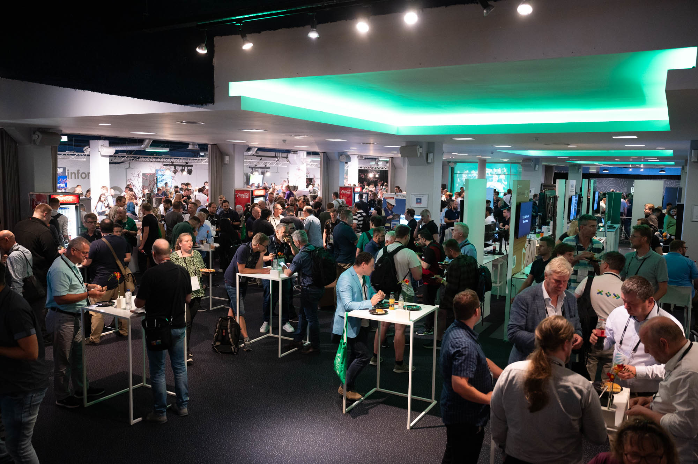
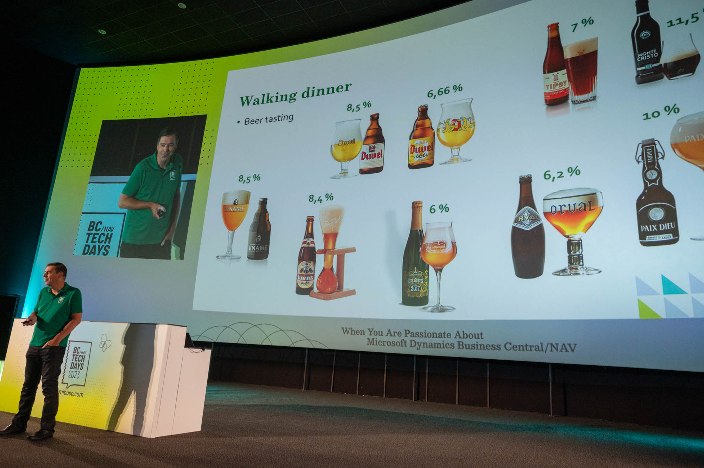
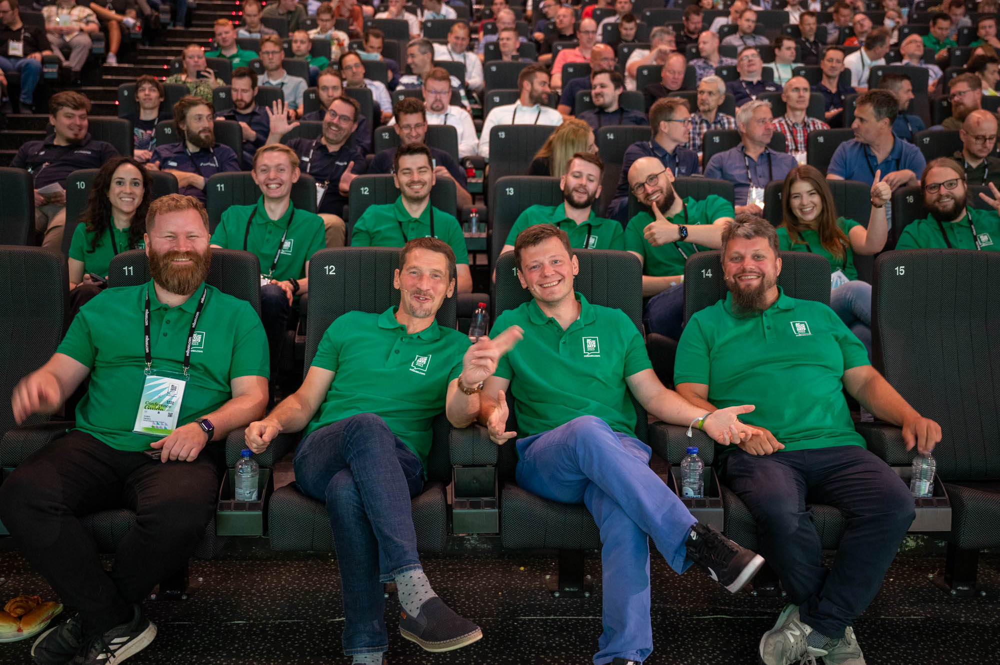
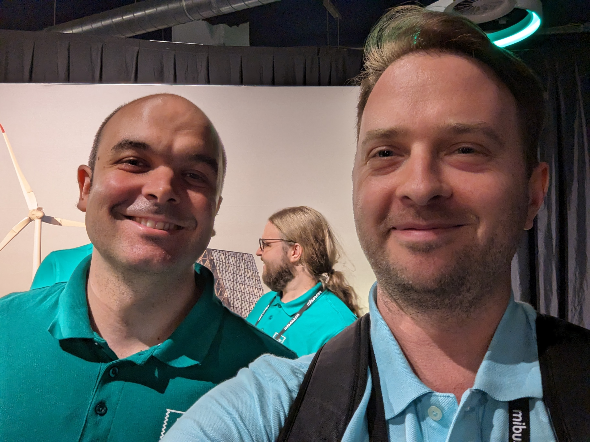
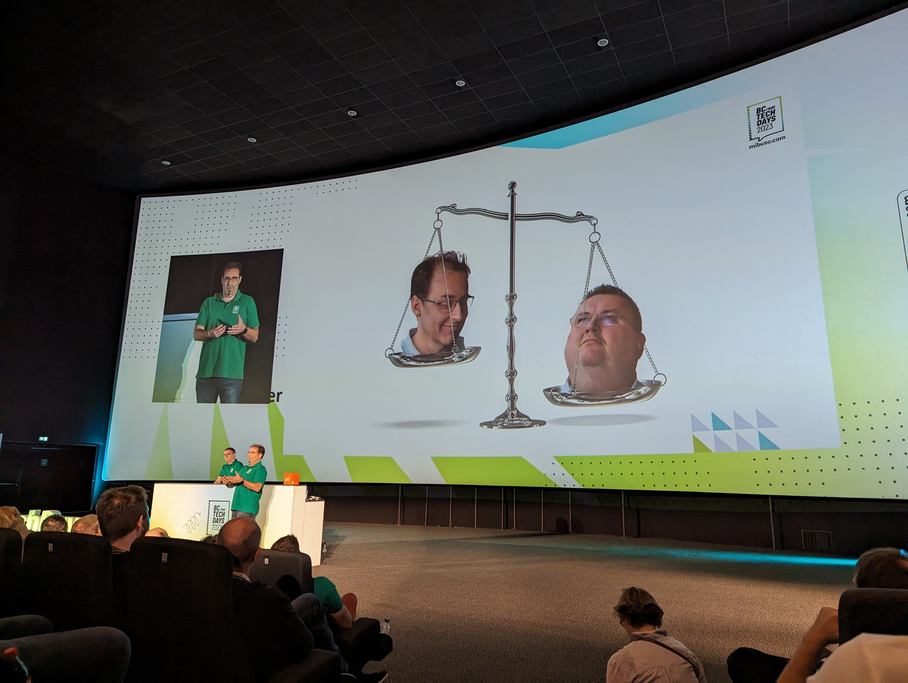
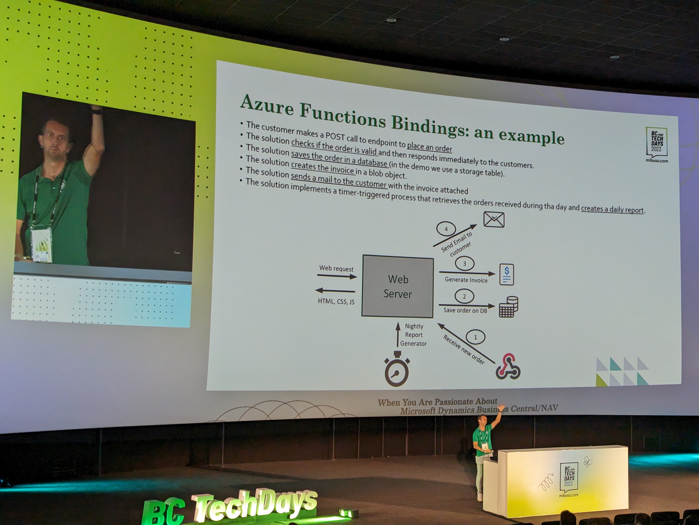
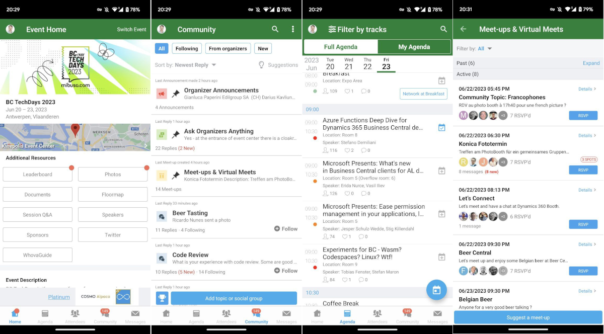
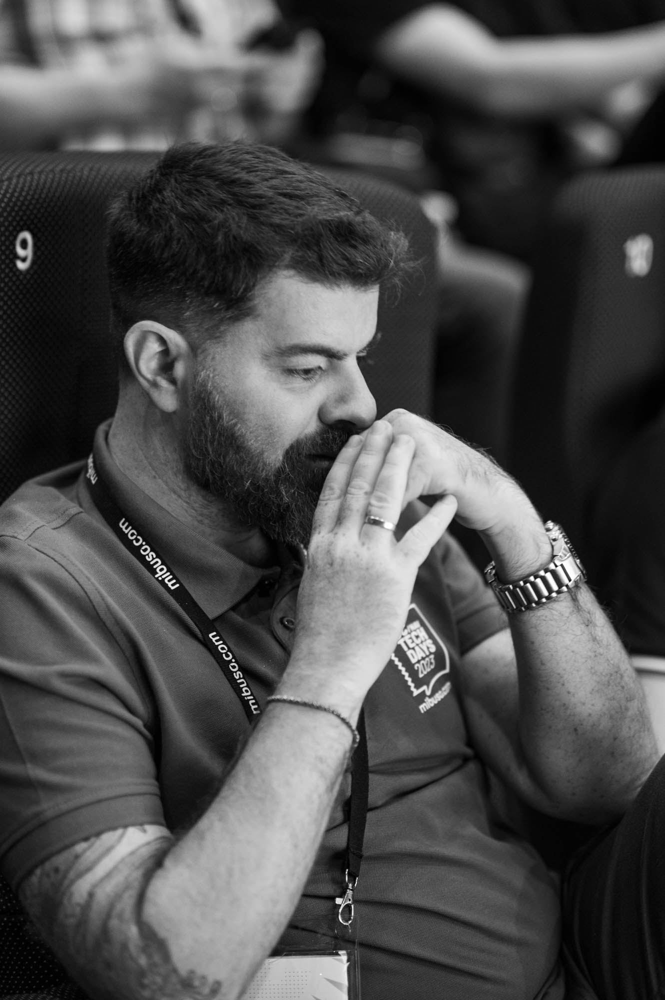

### Impressions
So, the conference is over, the planes are over, the trains are over, the fatigue has been washed away by the hustle and bustle of a new week. The new labor woes are already here, but the memory is fresh -- everything was remembered as a big (more than a thousand participants) and interesting event, rich and very positive. Now every June, instead of in the fall like it used to be.

The event was held on the backside of Antwerp, in a huge Kinepolis building, of which about half of the halls and space inside are rented. From the street it looks like an ordinary city outskirts, something reminiscent of the backyards of the Teply Stan metro station in Moscow, except without wind turbines.

Inside there are a lot of stands of European vendors and partners, and it was impossible to pass by them, you will get acquainted with all of them one way or another. But there was also a place to walk around - both sides of the main area are quite large, where you can chat, eat and drink something cool.

More in [photo album](https://www.flickr.com/photos/navtechdays/albums/72177720309307321/with/53000221314/) of the event.

The nice thing is that the organizers supply everyone with food from breakfast to dinner with *beer*, so you can take your time, be fed and satisfied the whole time. Is that why some of the "old-timers" of nava were snoring at the sessions? 😊

The halls are comfortable, the screens are big, the sound is great, the speakers are interesting, what more could you want? Of course, it all helps attention: questions were asked after each presentation, and after the speakers were finished, we asked something personally. A separate place in the hall was the corner of experts, where the speakers were available for communication for some more time.

It was great to see some employees from Microsoft Danish office in person, in particular I took a picture with Nicola, had a few words with Stifen, thanked Waldo and Vjekoslav personally, and met Dmitry Katson. I'm such a "networker", I wish I could learn from someone. 😊

Overall, from the sessions, there was quite a bit of insight. The product is becoming more and more integrated into cloud environments, more tools are becoming available, and migrations are becoming easier. With that in mind, it's always worth keeping this model in mind and not complicating life with solutions that pull "down".

Three cool sessions were particularly memorable, Stefano Demiliani's AzureFunctions talk, Nicola's "about blockchain" talk, and the duo of Waldo & Vjeko where both of them went wild in both standup and presentation, and quite eloquently deployed their approach to interfaces. Unfortunately, the video of their presentation will most likely not be available due to technical reasons. But they were applauded like Hans Zimmer 😊 Their [repository](https://github.com/vjekob/bctechdays2023/branches/active) has survived, where you can reconstruct code transformation by brunches --- from typical applications of interfaces to improved and advanced ones (see presentations and links below).

By my count, most of the sessions were led by Microsoft employees, and they certainly have a lot to share with the community in this regard. However, the sessions from MVPs and partners were also quite useful. I suspect there was some sort of selection process, so probably not everyone got in.

The event has its own mobile hub app with news, photos, a small forum all in one. Nothing fancy, but overall pretty handy to check in with people you don't know yet, discuss things, criticize, etc. It is called "Whova".

There were only two obvious problems: stuffiness and weak wifi. About the first one, the hot, stuffy, rainy weather was unfortunate, and the air conditioners couldn't handle so many people, and people were slowly sweating and freaking out. Well, and weak internet is purely technical part, everyone switched to mobile as they could.

From two days of intense lectures, as well as from the hangout in general, I got some pretty interesting impressions:
- It seems that many people here have known each other for a long time, somehow - vendors, partners, representatives of different companies. I noticed a lot of friendly greetings and fraternizations all days among people with different badges. It's cool.
- Partners and vendors are the lifeblood of the product. Statistically, most of the attendees are developers from the ISV/partners side specifically, and then from customers. Clients, in general, don't often send their teams to such an expensive event, so I consider myself lucky (~~or a person waiting for a pay raise~~).
 - The name is legion: the looks of our entire NAV/BC party, it turns out, look about the same in any country in the world. It's always people with discreet clothes, not showing off their achievements and skills, with serious faces, able to listen to others and talk business. As if they were molded from the same dough. However, in the evening and under Belgian, when everyone was having a rest, one could not distinguish them from ordinary visitors of other bars and cafes. So the similarity probably comes from how and where we work.
- One conclusion I made for myself is to take a closer look at ISVs in Germany. It may very well be even more interesting than the clients.
 - There are surprisingly many single experts; those who work in a freelance or contract hire format, acting as an expert in their field. A great role model, it seems to me.
 - One more conclusion is to try to do myself (and recommend to everyone) a more or less regular blog on the topic of NAV/BC and work in particular. From a personal perspective it seems of little value, but it actually shapes and rallies the community as a whole, even more than a personal brand.
 - One more thing: the community has so much more to say than once a year on the hottest and newest topics.
 - And once again I'm convinced: if someone is worried about their English - don't be, even for most of the speakers it's not native; the nuances of your pronunciation and possible inaccuracies won't cause problems for anyone.

#### Performances attended ###
 - Theta (NZ): Feature Management for Continuous Delivery
 - Microsoft: [What's new in AL](https://youtu.be/LwnMz0j9EXc)
 - Microsoft: [Introducing Microsoft Dynamics 365 Copilot](https://youtu.be/eAg3l9UHuQo)
 - Microsoft: [Unlock the Power of AL extension toolset: A detailed overview of AL code debugging and navigation](https://youtu.be/2GBRAiupenE)
 - Microsoft: What's new in cloud migration and upgrade
 - Microsoft: [Demystifying AppSource development](https://youtu.be/uIxV14TEA2s)
 - Microsoft: [Locking in AL: Runtime and explicit AL control](https://youtu.be/G3nwddMnWTI)
 - Microsoft: [Lessons learned from migrating to .NET Core](https://youtu.be/hQq89iLuwKc)
 - Stefano Demiliani: [Azure Functions Deep Dive for Dynamics 365 Business Central developers: present and future](https://youtu.be/4WwgwsAJlS4)
 - Waldo and Vjeko: The Power of Interfaces: Unleashing Their Full Potential in AL

 